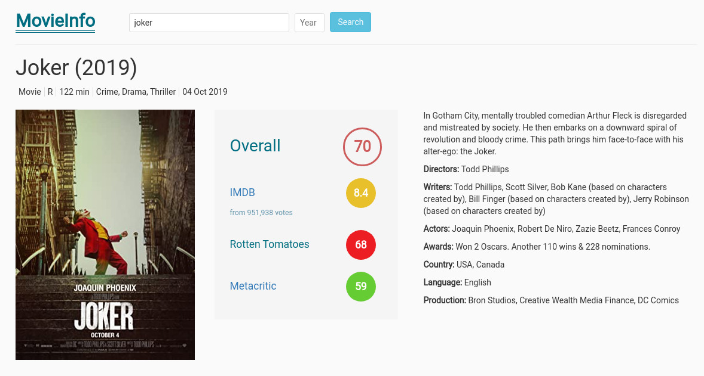

[MovieInfo](https://movie-info.ciavash.name/)
==========

A web app for viewing movie information and ratings.

Description
===========

MovieInfo makes it easy for you to find information and ratings for movies, TV series and games.

It shows ratings from IMDB and Metacritic.
It also shows an overall rating, which is the average of the ratings from the aforementioned websites.

[OMDb API](https://omdbapi.com/) is used for obtaining movie data.

Repository
==========

<https://github.com/CIAvash/movie-info>

Bugs
====

<https://github.com/CIAvash/movie-info/issues>

Author
======

Siavash Askari Nasr - <https://ciavash.name/>

Copyright and License
=====================
Copyright (C) 2021 Siavash Askari Nasr

This program is free software: you can redistribute it and/or modify
it under the terms of the GNU Affero General Public License as
published by the Free Software Foundation, either version 3 of the
License, or (at your option) any later version.

This program is distributed in the hope that it will be useful,
but WITHOUT ANY WARRANTY; without even the implied warranty of
MERCHANTABILITY or FITNESS FOR A PARTICULAR PURPOSE.  See the
GNU Affero General Public License for more details.
    
You should have received a copy of the GNU Affero General Public License
along with this program.  If not, see <https://www.gnu.org/licenses/>.